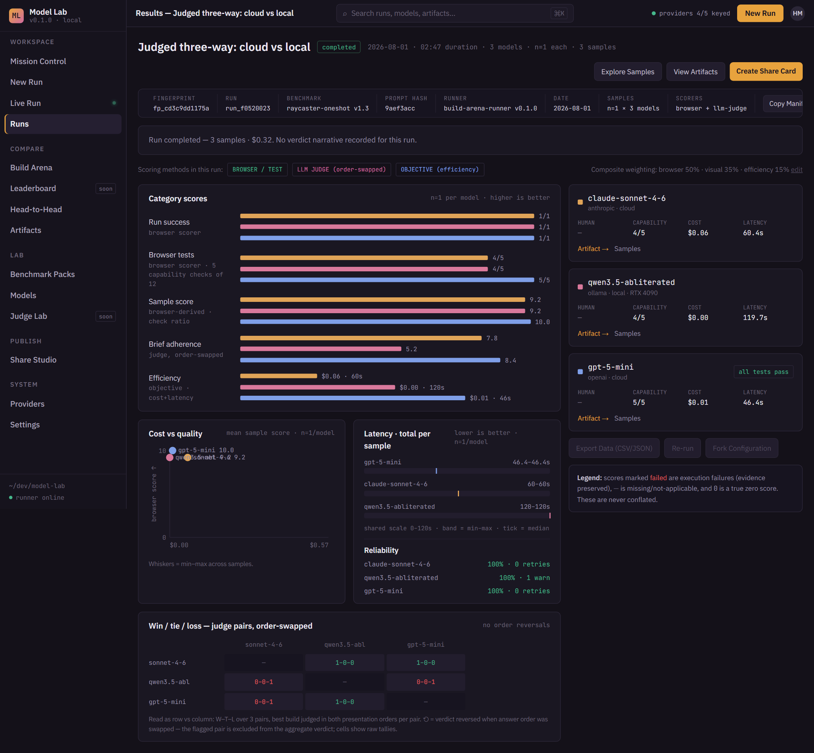
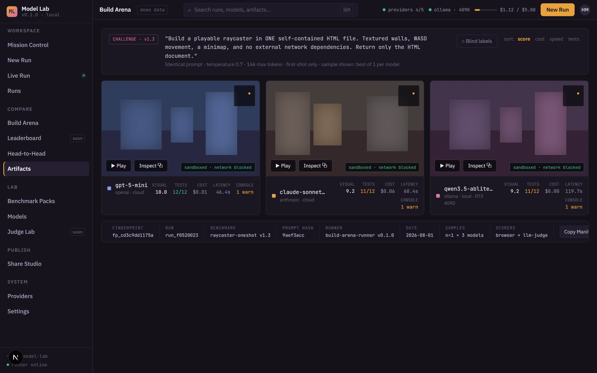
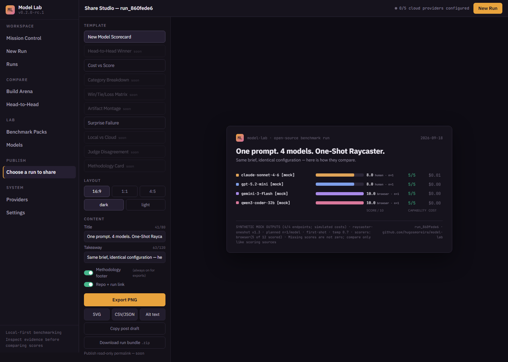

# Model Lab

> Run LLM comparisons, inspect captured artifacts, and export results with their evidence.

[](https://github.com/hugosmoreira/model-lab/actions/workflows/ci.yml)
[](LICENSE)
[](.nvmrc)

Model Lab is a local-first, open-source **LLM Benchmark & Build Arena**: send the same
one-shot build challenge (or objective test pack) to several models — cloud APIs and
local models side by side — under identical configuration. Watch the run live, execute
real browser tests against every generated artifact, judge the builds with an
order-swapped LLM judge, add your own ratings, and export results that trace back to a
reproducible run bundle.

**Source prerelease:** [v0.2.0-rc.1](https://github.com/hugosmoreira/model-lab/releases/tag/v0.2.0-rc.1)
is available with a source archive and verified checksums. The
[2026-09-17 audit](docs/AUDIT-2026-09-17.md) led to changes in artifact isolation,
spending controls, evidence storage and result labeling. The
[release plan](docs/RELEASE_PLAN.md) records verification and the unresolved
native advisory and redistribution gates that still block container publication.



## Historical example run

The screenshot above is `run_f0520023`, measured before the current candidate's
evidence and browser-check fixes. It is preserved as historical **n=1** evidence,
not a new model-ranking claim: one identical raycaster prompt was sent to
Claude (cloud), GPT (cloud), and a 17GB Qwen running locally on an RTX 4090:

| Model | Where | Capability checks | Judge rubric | Pairwise (both orders) | Cost |
|---|---|---|---|---|---|
| claude-sonnet-4-6 | Anthropic API | 4/5 — no minimap | 7.8/10 | beat both | $0.065 |
| gpt-5-mini | OpenAI API | **5/5** | **8.4/10** | beat qwen, lost to claude | $0.010 |
| qwen3.5 (17GB, local) | Ollama · RTX 4090 | 4/5 — WASD moved nothing | 5.2/10 | lost both | $0.00 |

Browser scoring counts the five capability checks only — a failed gate zeroes the score
outright, and diagnostics never score ([methodology](docs/ARCHITECTURE.md#scoring)).

Total: **$0.32** including 9 judge calls, 2m47s. All three builds cleared every gate, so
the two 4/5 rows tie on count but not on build: claude shipped no minimap, qwen's WASD
moved nothing, and in the wall region claude's frame measured 49.7% edge pixels to qwen's
2.3%. The methodology also surfaced a real tension: the judge's rubric scored gpt-5-mini
highest, yet picked Claude's build in direct comparison — in *both* presentation orders.
That's the kind of evidence a single leaderboard number hides.

The complete run bundle (manifest, per-sample results, artifacts, screenshots,
judge verdicts) is committed at [`docs/example-run/run_f0520023`](docs/example-run/run_f0520023),
which records the run as it was measured at the time, under the check set then in use.

## How it works

**Run it.** Pick a challenge pack and 2–8 models across providers (Anthropic, OpenAI,
DeepSeek, Gemini, OpenRouter, or local via Ollama/vLLM). Every model gets the identical
prompt, temperature, token budget, and retry policy — differences are flagged, never
silently ignored. Generation and judging reserve estimated cost before each
call and retry. Admission uses configured prices, prompt size and output caps;
provider invoices can differ, so this is not an exact billing guarantee.

**Inspect it.** The UI displays captured PNG evidence; generated scripts run only
in the browser-check runner. A response-header policy, context-wide HTTP and
WebSocket controls, and native Chromium WebRTC restrictions limit execution while 12
Playwright checks across three categories probe it for real: does the canvas render, does WASD move the player,
does it survive a resize, is the HUD readable. Failures are preserved as evidence —
one failed model never halts a run. These are browser controls, not a general
OS sandbox; see [the security boundary](SECURITY.md).

**Know the floor.** Add `baseline/blank-html` to any run: a deterministic document that
renders nothing, free and keyless, so every scorer's floor sits next to the contenders
instead of being assumed.

**Score it — with labeled sources.** Objective browser checks, an LLM judge that grades
each build against the brief *and* compares pairs anonymized in both presentation
orders (verdicts that flip on order-swap are flagged ⟲ and excluded from the tally),
and your own 0–10 ratings through an append-only audit trail. No score type
masquerades as another.

**Reproduce it.** New runs capture their configuration at creation, including
objective tasks and scorers, and export a versioned `replay.json` with exact
evidence references and SHA-256 hashes. Bundles include raw output and captured
screenshots. Source revision and dirty state are recorded when available;
legacy or incomplete provenance is explicit. A repeat configuration does not
guarantee identical output from a nondeterministic model.

**Publish it.** The Share Studio renders verified run data into X-ready cards
(PNG/SVG/CSV/JSON + alt text) with a methodology footer that cannot be removed.

<p>
  
  
</p>

Left: historical Build Arena. Right: the verified `0.2.0-rc.1` Share Studio using
**synthetic mock outputs**, including human and browser scores labeled separately.
The [390 px phone view](docs/screenshots/share-phone-0.2.0-rc.1-mock.png) shows the
same tested export workflow. These screenshots make no model-ranking claim.

## Quickstart

Requirements: a current security-patched Node 22 release (the API minimum is
22.13), pnpm 10 (`corepack enable` picks up the pinned patch), and the managed
Chrome Headless Shell. Verified archives are supplied for Linux amd64 and Windows
x64; other platforms need separate validation.

```bash
git clone https://github.com/hugosmoreira/model-lab
cd model-lab
pnpm install --frozen-lockfile
pnpm browser:install  # checksum-pinned, patched browser; no artifact-time download
pnpm dev        # http://127.0.0.1:3000 (this computer only)
```

On Linux, install browser system libraries before starting:
`pnpm --filter @model-lab/build-arena-runner exec playwright install-deps chromium`.
Artifact execution refuses browser versions older than the security minimum;
installing Playwright's default browser alone does not satisfy that gate.

The default memory store contains a clearly labelled illustrative run. Real runs
are listed alongside that seed; persistent stores begin empty. To force every
generation and provider-health path offline, set `MODEL_LAB_MOCK_PROVIDERS=1`.
In automatic mode, cloud endpoints missing a key are mocked and local Ollama
endpoints run against the configured local server. To configure the workspace, copy
[`.env.example`](.env.example) to `.env` at the repo root:

```bash
ANTHROPIC_API_KEY=...          # any subset — endpoints without a key run as
OPENAI_API_KEY=...             # clearly-marked mocks
DEEPSEEK_API_KEY=...
GOOGLE_API_KEY=...
OLLAMA_BASE_URL=http://localhost:11434   # local models via Ollama

MODEL_LAB_STORE=memory         # or sqlite | supabase (see docs/SUPABASE_SETUP.md)
MODEL_LAB_JUDGE_MODEL=claude-sonnet-4-6  # LLM judge (MODEL_LAB_JUDGE=0 disables)
```

## From the terminal

The same run, without the browser — for scripts and CI:

```bash
pnpm cli models                                   # what this environment can run, and what would be mocked
pnpm cli run --pack raycaster-oneshot \
  --models anthropic/claude-sonnet-4-6,openai/gpt-5-mini,ollama/qwen3.5-abliterated \
  --store sqlite --samples 3 --budget 2 --fail-under 0.8  # exit 1 below 4/5
```

It streams the run's events, prints capability, cost, latency and the model id each
provider actually served, exports the bundle, and exits non-zero on a partial run.
`--mock` uses deterministic providers. To see a CLI run in the UI, configure the
web process for SQLite too and use the same database and evidence paths. Memory
stores are process-local and disappear when that process exits.

## Architecture

pnpm workspace: `apps/web` (Next.js 15, App Router — UI + local API + SSE),
`packages/schemas` (Zod domain contracts + demo fixtures), `packages/store`
(memory / SQLite / Supabase persistence behind one interface),
`runners/build-arena` (provider adapters, parallel executor, Playwright checks,
judge phase, reproducible bundle writer), `benchmark-packs/` (versioned challenge
definitions). Provider credentials stay server-side; generated scripts do not
execute in the operator's UI. See [`docs/ARCHITECTURE.md`](docs/ARCHITECTURE.md)
for the architecture and [`SECURITY.md`](SECURITY.md) for the supported boundaries.

## Development

```bash
pnpm -r typecheck               # strict TypeScript across all four packages
pnpm lint && pnpm format:check  # ESLint + Prettier
pnpm test                       # store conformance · runner unit tests · check-taxonomy regression · mock selftest
pnpm build                      # production build (stop the dev server first)
```

CI runs the same gates on pushes to main and pull requests, using mocked providers.
[`CONTRIBUTING.md`](CONTRIBUTING.md) lists the extension points,
[`docs/ROADMAP.md`](docs/ROADMAP.md) what is planned and what is known to be wrong, and
[`CHANGELOG.md`](CHANGELOG.md) the candidate changes and historical checkpoints.

## Deploying

Model Lab runs as one container with a volume — it needs a real Chromium, local disk,
and a long-lived process, so serverless hosts are out. A public demo runs read-only on
mock providers (`MODEL_LAB_READ_ONLY=1`, `MODEL_LAB_MOCK_PROVIDERS=1`, no keys); a
private instance with real keys belongs behind authentication, because the API has none.
See [`docs/DEPLOY.md`](docs/DEPLOY.md) for runtime configuration and
[`docs/RELEASE_PLAN.md`](docs/RELEASE_PLAN.md) for the GitHub release sequence
and publication checks.

## Honest limitations

- One-shot visual benchmarks measure *one-shot visual building* — they are vivid and
  useful, not a general capability ranking. n=1 runs are anecdotes; raise samples for claims.
- The LLM judge is an estimate, never ground truth — that's why verdicts are
  order-swapped, labeled, and excluded when unstable.
- Formal eval-engine adapters (Inspect/OpenBench), Leaderboard, and Judge Lab are
  [roadmap](docs/ROADMAP.md), not features. Buttons marked `soon` are honest.

## License

Model Lab's own code is MIT — see [`LICENSE`](LICENSE). Dependencies retain their
own licenses; [`THIRD_PARTY_NOTICES.md`](THIRD_PARTY_NOTICES.md) records retained
notices and the binary distribution review. If Model Lab appears in research or
a published comparison, [`CITATION.cff`](CITATION.cff) has the reference.
