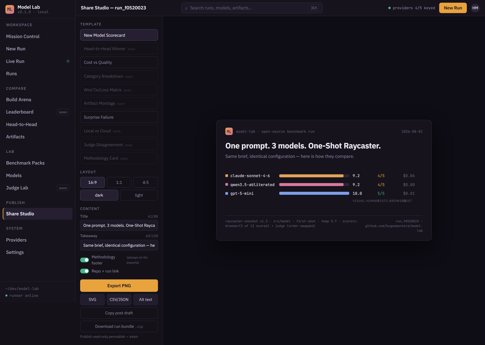

# Model Lab

> Run reproducible LLM comparisons, inspect live artifacts, and export publication-ready results.

Model Lab is a local-first, open-source **LLM Benchmark & Build Arena**: send the same
one-shot build challenge (or objective test pack) to several models — cloud APIs and
local models side by side — under identical configuration. Watch the run live, execute
real browser tests against every generated artifact, judge the builds with an
order-swapped LLM judge, add your own ratings, and export results that trace back to a
reproducible run bundle.


## A real run, not a mockup

The screenshot above is `run_f0520023` — one identical raycaster prompt sent to
Claude (cloud), GPT (cloud), and a 17GB Qwen running locally on an RTX 4090:

| Model | Where | Capability checks | Judge rubric | Pairwise (both orders) | Cost |
|---|---|---|---|---|---|
| claude-sonnet-4-6 | Anthropic API | 4/5 — no minimap | 7.8/10 | beat both | $0.065 |
| gpt-5-mini | OpenAI API | **5/5** | **8.4/10** | beat qwen, lost to claude | $0.010 |
| qwen3.5 (17GB, local) | Ollama · RTX 4090 | 4/5 — WASD moved nothing | 5.2/10 | lost both | $0.00 |

Browser scoring counts the five capability checks only — a failed gate zeroes the score
outright, and diagnostics never score ([methodology](docs/ARCHITECTURE.md#scoring)).

Total: **$0.32** including 9 judge calls, 2m47s. All three builds cleared every gate, so
the two 4/5 rows tie on count but not on build: claude shipped no minimap, qwen's WASD
moved nothing, and in the wall region claude's frame measured 49.7% edge pixels to qwen's
2.3%. The methodology also surfaced a real tension: the judge's rubric scored gpt-5-mini
highest, yet picked Claude's build in direct comparison — in *both* presentation orders.
That's the kind of evidence a single leaderboard number hides.

The complete run bundle (manifest, per-sample results, artifacts, screenshots,
judge verdicts) is committed at [`docs/example-run/run_f0520023`](docs/example-run/run_f0520023),
which records the run as it was measured at the time, under the check set then in use.

## How it works

**Run it.** Pick a challenge pack and 2–8 models across providers (Anthropic, OpenAI,
DeepSeek, Gemini, OpenRouter, or local via Ollama/vLLM). Every model gets the identical
prompt, temperature, token budget, and retry policy — differences are flagged, never
silently ignored. A hard budget ceiling stops runaway spend.

**Inspect it.** Each generated single-file HTML artifact runs inside a locked-down
sandbox (`allow-scripts` only, CSP `default-src 'none'`, network blocked) while 12
Playwright checks across three categories probe it for real: does the canvas render, does WASD move the player,
does it survive a resize, is the HUD readable. Failures are preserved as evidence —
one failed model never halts a run.

**Score it — with labeled sources.** Objective browser checks, an LLM judge that grades
each build against the brief *and* compares pairs anonymized in both presentation
orders (verdicts that flip on order-swap are flagged ⟲ and excluded from the tally),
and your own 0–10 ratings through an append-only audit trail. No score type
masquerades as another.

**Reproduce it.** Every run records its fingerprint, prompt hash, exact model IDs,
provider, configuration, runner version, and git commit — downloadable as a zip bundle
with raw outputs and screenshots.

**Publish it.** The Share Studio renders verified run data into X-ready cards
(PNG/SVG/CSV/JSON + alt text) with a methodology footer that cannot be removed.

<p>
  
  
</p>

## Quickstart

```bash
git clone https://github.com/hugosmoreira/model-lab
cd model-lab
pnpm install
pnpm --filter @model-lab/build-arena-runner exec playwright install chromium
pnpm dev        # http://localhost:3000
```

With no configuration you get a fully working demo on deterministic mock providers.
To benchmark real models, create a `.env` at the repo root:

```bash
ANTHROPIC_API_KEY=...          # any subset — endpoints without a key run as
OPENAI_API_KEY=...             # clearly-marked mocks
DEEPSEEK_API_KEY=...
GOOGLE_API_KEY=...
OLLAMA_BASE_URL=http://localhost:11434   # local models via Ollama

MODEL_LAB_STORE=memory         # or sqlite | supabase (see docs/SUPABASE_SETUP.md)
MODEL_LAB_JUDGE_MODEL=claude-sonnet-4-6  # LLM judge (MODEL_LAB_JUDGE=0 disables)
```

## Architecture

pnpm workspace: `apps/web` (Next.js 15, App Router — UI + local API + SSE),
`packages/schemas` (Zod domain contracts + demo fixtures), `packages/store`
(memory / SQLite / Supabase persistence behind one interface),
`runners/build-arena` (provider adapters, parallel executor, Playwright checks,
judge phase, reproducible bundle writer), `benchmark-packs/` (versioned challenge
definitions). Provider keys never reach the browser; generated code never escapes
the sandbox. See [`docs/ARCHITECTURE.md`](docs/ARCHITECTURE.md) for the full architecture and [`SECURITY.md`](SECURITY.md) for the threat model.

## Honest limitations

- One-shot visual benchmarks measure *one-shot visual building* — they are vivid and
  useful, not a general capability ranking. n=1 runs are anecdotes; raise samples for claims.
- The LLM judge is an estimate, never ground truth — that's why verdicts are
  order-swapped, labeled, and excluded when unstable.
- Formal eval-engine adapters (Inspect/OpenBench), Leaderboard, and Judge Lab are
  roadmap, not features. Buttons marked `soon` are honest.

## License

MIT
